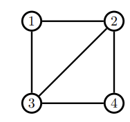
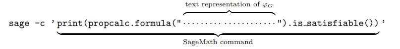
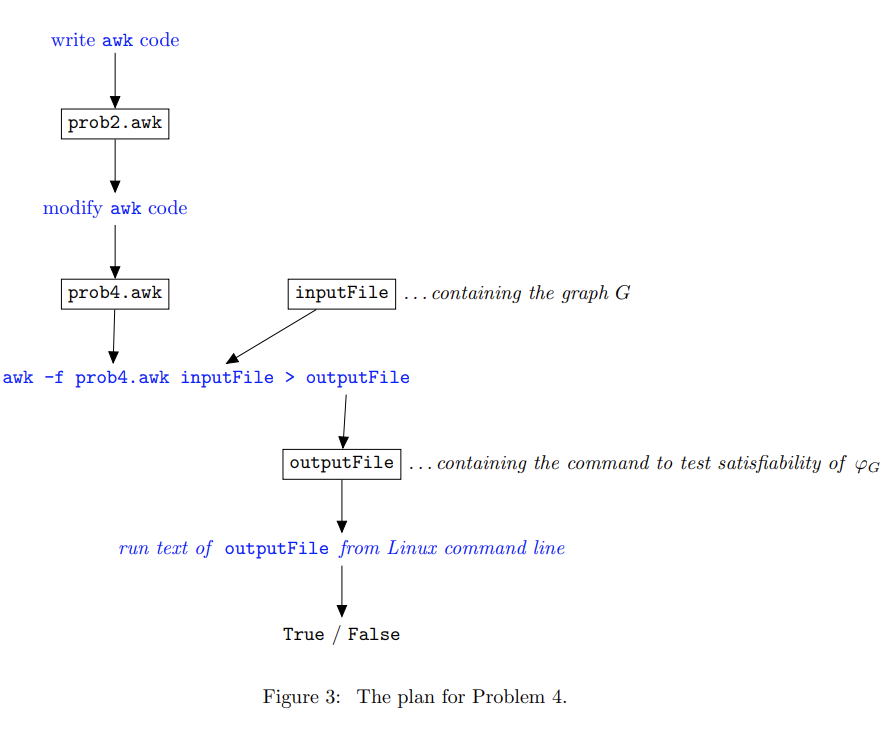

# FIT2014
Prob1 
- Boolean expression φH in CNF using the variables v(i,c) which is True if and only if the assignment of truth values to the variables represents a 3-colouring of H. 

Prob2
- an awk script that takes, as input, a graph G represented in the specified format in a text file, and produces, as output, a one-line file containing the text representation of a Boolean expression φG in CNF which uses the variables we have specified and which is True if and only if the variables describe a 3-colouring of G 

Prob3
- brief justification, an expression for the number of clauses of φG in terms of n (the number of vertices of G) and m (the number of edges of G)

Prob4
- Prob2 awk script modified to create the following one-line command:

Prob5
- Proof by induction on n, that a slithy Boolean expression in CNF with at most n variables has at most n clauses and is satisfiable. 
*A Boolean expression in CNF is slithy if, for all k ≥ 1, every set of k clauses includes a variable that appears only once among those clauses. So this condition must hold for every possible set of clauses in the expression.